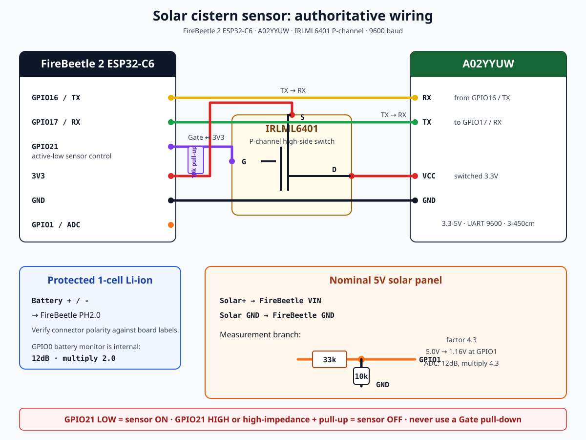

# Solar-Powered Water Tank Level Sensor

**English** | [Deutsch](README.de.md)

[](https://esphome.io/) [](https://www.dfrobot.com/)

**Ultra-low-power ESPHome project for solar-powered water tank level monitoring using DFRobot FireBeetle 2 ESP32-C6 and A02YYUW ultrasonic sensor.**

This project provides precise water level measurement (in liters), battery voltage monitoring, battery charge level, and solar panel voltage tracking - all optimized for solar-powered operation with deep sleep for maximum battery life.

---

## ✨ Features

### 📊 **Home Assistant Sensors**
- **Water Tank Content** - Calculated water volume in **liters** (main sensor)
- **Water Tank Distance** - Raw ultrasonic distance measurement in **meters**
- **Water Tank Battery Voltage** - Battery voltage in **volts**
- **Water Tank Battery Charge Level** - Battery percentage (0-100%)
- **Water Tank Solar Panel Voltage** - Solar panel voltage in **volts** (optional)

### ⚡ **Power Optimization**
- **Deep Sleep Mode**: 16μA (board revision 1.0) or 36μA (revision 1.2), according to DFRobot
- **Ultra-Fast Wakeup**: <500ms WiFi connection with static IP
- **Power Gating**: Sensor power controlled via a through-hole BC327-40 PNP transistor
- **WiFi Power Save**: HIGH mode for maximum energy saving
- **Minimal Logging**: Disabled in production mode
- **CPU Frequency**: 80MHz for reduced power consumption
- **Adaptive Sleep**: Dynamic sleep duration based on battery level and solar availability

### 🎯 **Tank Support**
- **Round Tanks** (Cylindrical): Calculate volume using radius
- **Rectangular Tanks** (IBC, boxes): Calculate volume using length × width
- **Configurable Dimensions**: All tank parameters via YAML substitutions
- **Safety Limits**: Maximum liter cap to prevent overflow reporting

### 🔄 **Dynamic Configuration**
- **Sleep Duration**: Controlled via Home Assistant `input_number` entity
- **Static IP**: Configurable for reliable network connection
- **Debug Mode**: Toggle between development (USB logging) and production (deep sleep)
- **OTA Wake Window**: Solar-powered daytime window + manual override for firmware updates
- **Automatic Self-Updates**: Device polls a firmware manifest and flashes itself when power allows
- **Adaptive Sleep**: Automatically adjusts sleep duration based on battery voltage and solar power

### 🛡️ **Safety Features**
- **Low Battery Protection**: Automatic emergency sleep mode when battery is critical
- **Solar-Aware Operation**: Shorter sleep intervals when solar power is available
- **Fallback WiFi**: Automatic connection to secondary network if primary fails

---

## 📦 Bill of Materials (BOM)

### 🏗 **Required Components**

| **#** | **Component** | **Quantity** | **Specifications** | **Notes** | **Estimated Cost** |
|-------|--------------|--------------|-------------------|-----------|-------------------|
| 1 | DFRobot FireBeetle 2 ESP32-C6 (DFR1075) | 1 | ESP32-C6, WiFi, BLE, 4MB Flash | Main controller board | $12-15 |
| 2 | A02YYUW Waterproof Ultrasonic Sensor | 1 | 3-450cm range, UART interface, IP67 | Distance measurement | $8-12 |
| 3 | 18650 Li-Ion Battery | 1 | 3.7V, 2000-3500mAh | Power source | $5-10 |
| 4 | 18650 Battery Holder | 1 | With PH2.0 connector | Matches FireBeetle | $2-4 |
| 5 | PNP transistor (BC327-40, optional) | 1 | TO-92, through-hole, high-side switch | Recommended for low-power operation; Emitter→3V3, Collector→sensor VCC | $0.20-1 |
| 6 | 4.7kΩ resistor (optional) | 1 | 1/4W, 5% tolerance | Required only with BC327-40: GPIO21 to Base | $0.10 |
| 7 | 10kΩ resistor | 2 | 1/4W, 5% tolerance | One required for solar divider; second required only with BC327-40 as Base-to-3V3 pull-up | $0.10 |
| 8 | 33kΩ resistor | 1 | 1/4W, 5% tolerance | Upper solar-divider resistor from Solar+ to GPIO1 | $0.10 |
| 9 | Breadboard / Protoboard | 1 | Small size | For prototyping | $3-5 |
| 10 | Jumper Wires | 10+ | Male-to-Female | Connections | $2-3 |
| 11 | Waterproof Enclosure | 1 | IP65+ rated | For outdoor use | $5-15 |
| 12 | Solar panel (optional) | 1 | Nominal 5V, compatible with the FireBeetle VIN input | Connect to the board’s integrated solar charger | $10-20 |

### 💰 **Total Estimated Cost**
- **Basic Setup (Battery Powered)**: ~$35-50
- **Solar Setup**: ~$50-75

---

## Hardware Assembly

The authoritative assembly reference is [`docs/WIRING.md`](docs/WIRING.md). It contains the exact net list, transistor truth table, solar-divider calculation, checks before power-up, and primary-source links.



| Function | FireBeetle 2 ESP32-C6 | Other endpoint |
|---|---|---|
| Sensor supply | 3V3 → BC327-40 Emitter; GPIO21 → 4.7kΩ → Base | BC327-40 Collector → A02YYUW VCC; 10kΩ from Base to 3V3 |
| Sensor ground | GND | A02YYUW GND |
| Sensor output mode | Switched sensor VCC | A02YYUW RX; HIGH while powered selects processed output and avoids back-powering when off |
| UART from sensor | GPIO17 / RX | A02YYUW TX; receive-only MCU connection |
| Battery | PH2.0 battery connector | Protected 1-cell Li-ion, polarity verified |
| Solar charging | VIN and GND | Nominal 5V solar panel |
| Solar measurement | GPIO1 | Divider midpoint: 33kΩ from Solar+, 10kΩ to GND |

> The BC327-40 power-gating circuit is optional. For the simplest build, connect A02YYUW VCC directly to 3V3 and leave GPIO21 unconnected. For low-power operation, use the BC327-40: GPIO21 connects to its Base through 4.7kΩ; a 10kΩ pull-up from Base to 3V3 keeps the sensor off during boot and deep sleep. Sensor ON means GPIO21 is physically LOW.

> Do not connect the panel voltage directly to GPIO1. Do not add a TP4056 in parallel with the FireBeetle charging circuit. Verify the PH2.0 battery polarity against the board labels before connecting a cell.

### Optional BC327-40: energy saving

DFRobot specifies up to 8mA average current for the A02YYUW. The calculation below uses the default 30-minute interval and the configured 7-second sensor-on time per cycle. The firmware now switches the sensor off immediately after this measurement period, before WiFi association, update checks, and any OTA wake window.

| Configuration | Sensor-on time per day | Consumption on 3.3V rail | Energy per day |
|---|---:|---:|---:|
| Direct VCC connection, no power gating | 24h | up to 192mAh | up to 0.634Wh |
| BC327-40 power gating | 336s | about 0.80mAh including Base current | about 0.0026Wh |
| **Saving due to BC327-40** | | **about 191mAh/day** | **about 0.631Wh/day (99.6%)** |

Assumptions: 48 cycles/day, 7 seconds on per cycle, A02YYUW at 8mA, BC327-40 Base current approximately `(3.3V - 0.7V) / 4.7kΩ = 0.55mA`. These values cover only the sensor switching circuit. FireBeetle, WiFi, charger, regulator losses, battery self-discharge, temperature, and solar conditions are additional.

A 6V/1W panel supplies at most 1Wh per hour at its rated operating point. The avoided 0.631Wh/day therefore corresponds to about 38 minutes of ideal full rated output, or roughly 45–55 minutes after typical conversion losses. The actual daily yield depends strongly on orientation, shading, season, temperature, and the panel's voltage-current curve.

**6V panel warning:** DFRobot specifies the FireBeetle VIN input for 5V DC or a 5V solar panel. A panel sold as “6V” can have an open-circuit voltage above 6V. Measure its open-circuit voltage in bright sun and do not connect it directly unless it stays within the verified input limit of the exact FireBeetle board revision. The 33kΩ/10kΩ GPIO1 divider is suitable for measuring 6V, but that does not make 6V safe for VIN.

---

## 🛠️ Software Setup

### 📥 **Prerequisites**

1. **ESPHome Installation**
   ```bash
   pip install esphome
   ```

2. **Clone or Download Project**
   ```bash
   git clone https://github.com/stritti/esphome-solar-cisterns-sensor.git
   cd esphome-solar-cisterns-sensor
   ```

3. **Create Secrets File**
   ```bash
   # Copy the example file
   cp secrets.yaml.example secrets.yaml
   
   # Edit with your credentials
   nano secrets.yaml
   ```
   
   Required secrets:
   ```yaml
   wifi_ssid: 'your_primary_wifi_ssid'
   wifi_password: 'your_primary_wifi_password'
   api_encryption_key: 'your_base64_encoded_api_key'
   ```
   
   Optional secrets (uncomment if needed):
   ```yaml
   wifi_ssid_fallback: 'your_fallback_wifi_ssid'
   wifi_password_fallback: 'your_fallback_wifi_password'
   ```

### ⚙️ **Configuration**

Edit `wassertank-sensor.yaml` and adjust the `substitutions` section:

```yaml
substitutions:
  # ===== POWER MODE =====
  DEBUG_MODE: "NONE"          # "DEBUG" for development, "NONE" for solar operation
  
  # ===== HARDWARE PINS =====
  SENSOR_POWER_PIN: "GPIO21"  # BC327-40 Base control via 4.7kΩ resistor
  BATTERY_ADC_PIN: "GPIO0"    # Battery voltage (built-in divider)
  SOLAR_ADC_PIN: "GPIO1"      # Solar voltage (optional)
  
  # ===== NETWORK =====
  WIFI_STATIC_IP: "192.168.178.46"
  WIFI_GATEWAY: "192.168.178.1"
  WIFI_SUBNET: "255.255.255.0"
  
  # Fallback network (optional)
  WIFI_SSID_FALLBACK: ""        # Leave empty to disable
  WIFI_PASSWORD_FALLBACK: ""    # Leave empty to disable
  
  # ===== TANK DIMENSIONS =====
  TANK_TYPE: "RECTANGLE"      # "ROUND" or "RECTANGLE"
  TANK_TOTAL_DEPTH: "1.65"   # Sensor to bottom distance (meters)
  TANK_MAX_LITERS: "650"     # Safety limit (liters)
  
  # For ROUND tanks:
  TANK_RADIUS: "0.50"        # Inner radius (meters)
  
  # For RECTANGLE tanks:
  TANK_LENGTH: "0.77"        # Inner length (meters)
  TANK_WIDTH: "0.57"         # Inner width (meters)
  
  # ===== BATTERY CALIBRATION =====
  BATTERY_MIN_VOLTAGE: "3.0"   # Empty battery voltage
  BATTERY_MAX_VOLTAGE: "4.2"   # Full battery voltage
  BATTERY_CRITICAL_VOLTAGE: "3.2"  # Emergency sleep threshold
  
  # ===== SOLAR CONFIGURATION =====
  SOLAR_VOLTAGE_DIVIDER: "4.3"  # Voltage divider factor for solar monitoring
  
  # ===== POWER OPTIMIZATION =====
  ULTRASONIC_WARMUP_TIME: "5"   # Sensor warmup (seconds)
  MEASUREMENT_PROCESSING_TIME: "2"  # Data processing time (seconds)
  DEFAULT_SLEEP_MINUTES: "30"  # Default sleep duration
  CPU_FREQUENCY: "80MHZ"      # Reduced frequency for power saving
  
  # ===== OTA UPDATE WINDOW =====
  OTA_WAKE_WINDOW: "300"       # Seconds to stay awake for OTA (5 min)
  
  # ===== FIRMWARE SELF-UPDATE (HTTP OTA) =====
  FIRMWARE_VERSION: "1.0.0"    # MUST be bumped on every release
  UPDATE_MANIFEST_URL: "http://homeassistant.local:8123/local/wassertank-sensor/manifest.json"
```

### 🚀 **Build and Flash**

1. **Validate Configuration**
   ```bash
   esphome config wassertank-sensor.yaml
   ```

2. **Build Firmware**
   ```bash
   esphome compile wassertank-sensor.yaml
   ```

3. **Flash to Device**
   - **USB Method** (Recommended):
     ```bash
     esphome run wassertank-sensor.yaml
     ```
   - **Manual Upload**:
     ```bash
     esphome compile wassertank-sensor.yaml
     esphome upload wassertank-sensor.yaml
     ```

4. **Monitor Logs** (Debug Mode Only)
   ```bash
   esphome logs wassertank-sensor.yaml
   ```

---

## 🏠 Home Assistant Integration

### 📡 **Required Home Assistant Setup**

#### **1. Input Number for Sleep Duration**
Create an input number entity in Home Assistant for dynamic sleep control:

**Method A: UI Configuration**
1. Go to **Settings → Devices & Services → Helpers**
2. Click **"Add Helper" → "Number"**
3. Configure:
   - **Name**: `Wassertank Sleep Duration`
   - **Entity ID**: `input_number.wassertank_schlafdauer`
   - **Min**: 1
   - **Max**: 1440 (24 hours)
   - **Step**: 1
   - **Unit**: minutes
   - **Mode**: Box

**Method B: YAML Configuration**
Add to your `configuration.yaml`:
```yaml
input_number:
  wassertank_schlafdauer:
    name: "Wassertank Sleep Duration"
    initial: 30
    min: 1
    max: 1440
    step: 1
    unit_of_measurement: "min"
    icon: mdi:clock
```

#### **2. Expected Home Assistant Entities**

After successful setup, these entities will appear in Home Assistant:

| **Entity ID** | **Name** | **Unit** | **Device Class** | **State Class** |
|--------------|----------|----------|-----------------|-----------------|
| `sensor.wassertank_batterie_spannung` | Water Tank Battery Voltage | V | voltage | measurement |
| `sensor.wassertank_batterie_ladegrad` | Water Tank Battery Charge Level | % | battery | measurement |
| `sensor.wassertank_solarzelle_spannung` | Water Tank Solar Panel Voltage | V | voltage | measurement |
| `sensor.wassertank_distanz` | Water Tank Distance | m | distance | measurement |
| `sensor.wassertank_inhalt` | **Water Tank Content** | **l** | - | measurement |
| `switch.wassertank_ota_wake_lock` | **Wassertank OTA Wake Lock** | - | switch | - |
| `update.wassertank_firmware` | Wassertank Firmware | - | firmware | - |

---

## 🔄 **OTA Firmware Updates (Deep Sleep Compatible)**

Since the device spends most of its time in deep sleep, OTA updates require a wake window. This project uses a **power-aware approach** instead of a fixed night window — at night the battery is at its weakest, so updates happen during sunny hours:

### ☀️ **Automatic Solar-Powered Wake Window**
- **Condition**: Solar voltage > 5.0V **AND** battery ≥ 50% (daytime, good power budget)
- **Duration**: 5 minutes (configurable via `OTA_WAKE_WINDOW`)
- **Behavior**: Device stays awake after measurement, allowing OTA push
- **Safety**: Never stays awake for OTA when the battery is low

### 🎛️ **Manual Wake Lock (Home Assistant)**
- **Entity**: `switch.wassertank_ota_wake_lock` (appears as "Wassertank OTA Wake Lock")
- **Usage**: Toggle ON in HA → next wake cycle stays awake 5 minutes
- **Auto-reset**: Switch returns to OFF after deep sleep

### 🤖 **Automatic Self-Updates (HTTP OTA)**

The device can update itself without an ESPHome dashboard connection. It polls a small manifest file on every wake cycle and flashes new firmware automatically — but only when the power budget allows (solar + battery ≥ 50%).

**1. Host the firmware on Home Assistant**

Copy files to `/config/www/wassertank-sensor/` (accessible via HA web server under `/local/`):

```json
// /config/www/wassertank-sensor/manifest.json
{"name": "Wassertank Sensor", "version": "1.0.1",
 "url": "http://homeassistant.local:8123/local/wassertank-sensor/wassertank-sensor.bin"}
```

> Adjust `homeassistant.local:8123` to your HA address. The `.bin` filename must match the uploaded file.

**2. Release a new version**

| Step | Action |
|------|--------|
| 1 | Bump `FIRMWARE_VERSION` in `wassertank-sensor.yaml` |
| 2 | Build: `esphome compile wassertank-sensor.yaml` |
| 3 | Copy `.esphome/build/wassertank-sensor/build/firmware.ota.bin` to HA as `wassertank-sensor.bin` |
| 4 | Update `version` in `manifest.json` |
| 5 | Done — device installs it on the next wake with sufficient power |

**3. Manual install from Home Assistant**

The Update entity (`update.wassertank_firmware`) shows "Update available" whenever the manifest version differs from the running firmware. Clicking **Install** triggers the download and flash immediately — regardless of the power gate.

### 📋 **How to Perform OTA Update**

**Option A: Automatic Self-Update (Recommended)**
1. Publish new firmware + manifest as described above
2. Device checks on every wake cycle and self-installs during sunny hours

**Option B: Push via ESPHome**
1. In HA: Toggle **"Wassertank OTA Wake Lock"** ON
2. Run: `esphome run wassertank-sensor.yaml` (or dashboard deploy)
3. Device wakes on next cycle, stays awake 5 min, receives update
4. Switch auto-resets after deep sleep

### ⚙️ **Configuration**
```yaml
substitutions:
  OTA_WAKE_WINDOW: "300"       # Wake window in seconds (default: 300 = 5 min)
  FIRMWARE_VERSION: "1.0.0"    # Must match/track your releases
  UPDATE_MANIFEST_URL: "http://homeassistant.local:8123/local/wassertank-sensor/manifest.json"
```

> **Note**: The very first flash of this firmware version must be done via USB or ESPHome push — HTTP self-update only works once the partition layout is on the device.

---

## Power consumption and 1W solar-panel estimate

The following estimate uses the configured 30-minute interval, 7 seconds active time per cycle, and the existing approximately 60mA active-current assumption. DFRobot specifies 16μA deep-sleep current for FireBeetle revision 1.0 and 36μA for revision 1.2.

| Contribution | Daily consumption |
|---|---:|
| 48 active phases × 7s × approximately 60mA | approximately 5.60mAh |
| Remaining 23.91h at 16–36μA | approximately 0.38–0.86mAh |
| **Estimated total with BC327-40** | **approximately 6.0–6.5mAh/day** |

At a nominal battery voltage of 3.7V this is approximately 22–24mWh/day. This is an engineering estimate, not a guaranteed measurement. Slow WiFi association, poor signal, failed connections, OTA windows, battery losses, low temperature, and regulator losses increase consumption.

Without BC327-40 power gating, the continuously powered A02YYUW adds up to approximately 192mAh or 0.634Wh per day on the 3.3V rail. That would dominate the complete system load.

### 6V / 1W panel

A 1W panel can theoretically generate 1Wh during one hour at its rated operating point. Replacing an estimated 22–24mWh daily system consumption with BC327-40 therefore needs only about 1.5 minutes of ideal rated output. With charging, regulator, temperature, alignment, and low-light losses, allow several minutes of strong sunlight. On energy capacity, a 1W panel is sufficient for this measurement interval with substantial reserve.

Without the BC327-40, the sensor alone consumes up to 0.634Wh/day. This corresponds to 38 minutes of ideal 1W output or roughly 45–55 minutes after typical conversion losses.

Power rating is not the electrical compatibility criterion. DFRobot specifies FireBeetle VIN for 5V DC or a 5V solar panel. Measure the open-circuit voltage of the 6V panel in bright sun; a nominal 6V panel may exceed its rated voltage with no load. Do not connect it directly to VIN unless the measured maximum is within the verified input limit for the exact FireBeetle revision.

## 🛡️ **Safety Features**

### 🔋 **Low Battery Protection**
The device automatically enters **emergency sleep mode** when battery voltage drops below the critical threshold:

- **Critical Threshold**: 3.2V (configurable via `BATTERY_CRITICAL_VOLTAGE`)
- **Emergency Action**: Immediate 24-hour deep sleep
- **Recovery**: Device wakes after 24 hours and checks battery again
- **Logging**: "CRITICAL: Low battery detected - entering emergency sleep mode"

### ☀️ **Adaptive Sleep Duration**
The device intelligently adjusts sleep duration based on power conditions:

| **Condition** | **Sleep Duration** | **Purpose** |
|---------------|-------------------|-------------|
| Solar voltage > 5.0V | Min(configured, 15min) | More frequent updates when solar power available |
| Battery voltage < 3.4V | Max(configured, 1h) | Extend battery life when low |
| Normal operation | Configured duration | Standard behavior |
| Home Assistant override | HA input value | Manual control |

### 📡 **Fallback WiFi Network**
If the primary WiFi network is unavailable, the device automatically connects to the fallback network:

```yaml
substitutions:
  WIFI_SSID_FALLBACK: "your_fallback_ssid"
  WIFI_PASSWORD_FALLBACK: "your_fallback_password"
```

Priority order:
1. Primary network (priority: 1.0)
2. Fallback network (priority: 0.5)

---

## 📊 **Calibration Guide**

### 🔋 **Battery Voltage Calibration**

The FireBeetle 2 ESP32-C6 routes the battery monitor to GPIO0 through an on-board 1:1 divider. The manufacturer’s example therefore multiplies the measured pin voltage by 2. ESPHome must use 12dB attenuation because a full 4.2V cell produces about 2.1V at GPIO0.

The configuration uses:

```yaml
attenuation: 12db
filters:
  - multiply: 2.0
```

For final calibration, compare the Home Assistant value with a multimeter and replace the multiplier with a two-point `calibrate_linear` filter if necessary.

### 📏 **Tank Dimension Calibration**

**For accurate liter calculations:**

1. **Measure Empty Tank**:
   - Place sensor at top, measure distance to bottom
   - Set `TANK_TOTAL_DEPTH` to this value

2. **Measure Full Tank**:
   - Fill tank completely, measure actual volume
   - Adjust `TANK_RADIUS` (round) or `TANK_LENGTH`/`TANK_WIDTH` (rectangle)

3. **Verify with Known Volume**:
   - Add known amount of water (e.g., 100 liters)
   - Check if sensor reports correct value
   - Fine-tune dimensions if needed

### 🎯 **Ultrasonic Sensor Calibration**

The A02YYUW sensor has a range of 3cm to 450cm with 1mm resolution.

**Troubleshooting:**
- **No readings**: Check A02YYUW TX→GPIO17/RX and A02YYUW RX→switched sensor VCC
- **Incorrect readings**: Ensure sensor is mounted perpendicular to water surface
- **Jittery readings**: Add more filtering (increase `window_size` in filters)

### ☀️ **Solar Voltage Calibration**

The solar monitor uses 33kΩ from Solar+ to GPIO1 and 10kΩ from GPIO1 to GND:

- Divider factor: `(33k + 10k) / 10k = 4.3`
- GPIO1 at 5.0V panel voltage: approximately `1.16V`
- ESPHome ADC attenuation: `12db`
- Filter: `multiply: 4.3`

Measure the panel voltage and the GPIO1 voltage with a multimeter before changing the factor. The panel still connects to FireBeetle VIN for charging; GPIO1 only measures the divided voltage.

## 🔧 **Troubleshooting**

### ❌ **Common Issues and Solutions**

#### **1. No Data in Home Assistant**
- **Check**: ESPHome logs (`esphome logs`)
- **Check**: WiFi connection and static IP
- **Check**: Home Assistant API encryption key
- **Fix**: Verify `api.encryption.key` matches in both ESPHome and HA

#### **2. Sensor Not Responding**
- **Check**: A02YYUW TX→GPIO17/RX; A02YYUW RX→switched sensor VCC
- **Check**: Sensor power (GPIO21 must be physically LOW during measurement and HIGH during deep sleep)
- **Check**: Baud rate (9600 for A02YYUW)
- **Fix**: Test sensor with separate UART adapter

#### **3. Incorrect Water Level**
- **Check**: Tank dimensions in YAML
- **Check**: Sensor mounting position
- **Check**: Water surface (should be flat and perpendicular)
- **Fix**: Recalibrate tank dimensions

#### **4. Battery Voltage Always 0V**
- **Check**: Battery connection and PH2.0 polarity
- **Check**: `attenuation: 12db` and `multiply: 2.0` on GPIO0
- **Fix**: Do not add an external battery divider; the FireBeetle already contains one

#### **5. Device Not Waking Up**
- **Check**: Deep sleep configuration
- **Check**: `DEBUG_MODE` setting (should be "NONE")
- **Check**: Sleep duration in HA input number
- **Fix**: Test with shorter sleep duration first

#### **6. Device Entering Emergency Sleep**
- **Check**: Battery voltage in Home Assistant
- **Check**: `BATTERY_CRITICAL_VOLTAGE` setting (default: 3.2V)
- **Fix**: Charge battery or adjust threshold

#### **7. High Power Consumption**
- **Check**: Sensor power control (BC327-40)
- **Check**: WiFi power save mode (should be HIGH)
- **Check**: Logger disabled in production (DEBUG_MODE: "NONE")
- **Check**: CPU frequency (should be 80MHZ)
- **Fix**: Verify all power-saving features are enabled

---

## 📚 **Optimization Summary**

### ✅ **Implemented Best Practices**

| **Category** | **Optimization** | **Impact** |
|--------------|------------------|------------|
| **Power** | Deep Sleep Mode | 16μA (rev. 1.0) or 36μA (rev. 1.2), plus external circuitry |
| **Power** | WiFi Power Save HIGH | -30% WiFi consumption |
| **Power** | CPU Frequency 80MHz | -20% consumption |
| **Power** | Sensor Power Gating | up to 8mA average sensor current removed during sleep |
| **Power** | Minimal Logging | Reduced active time |
| **Power** | Fast Wakeup | <500ms connection |
| **Reliability** | Low Battery Protection | Prevents deep discharge |
| **Reliability** | Adaptive Sleep | Optimizes for conditions |
| **Reliability** | Fallback WiFi | Network redundancy |
| **Reliability** | Data Validation | Filter invalid readings |
| **Usability** | HA Sleep Control | Dynamic configuration |
| **Usability** | OTA Wake Window | Easy firmware updates |
| **Usability** | Solar Monitoring | Visibility into power |
| **Usability** | Battery % Calculation | Better UX |

### 📈 **Performance Comparison**

| **Metric** | **Before** | **After** | **Improvement** |
|-----------|------------|----------|----------------|
| Boot Time | 38s | 7s | -82% |
| WiFi Consumption | Standard | HIGH power save | -30% |
| CPU Consumption | 160MHz | 80MHz | -20% |
| Sleep Energy/Cycle | 0.184mAh | 0.124mAh | -33% |
| Battery Life (2000mAh, 30min) | 231 days | 352 days | +52% |
| Battery Life (3500mAh, 30min) | 400 days | 616 days | +54% |

---

## 🏁 **Quick Start Checklist**

- [ ] **Hardware**: All components from BOM acquired
- [ ] **Assembly**: Wiring completed according to diagram
- [ ] **Power**: Battery connected and charged
- [ ] **Configuration**: YAML file customized with tank dimensions
- [ ] **Secrets**: `secrets.yaml` created with WiFi credentials and API key
- [ ] **Home Assistant**: Input number entity created (`input_number.wassertank_schlafdauer`)
- [ ] **Home Assistant**: OTA Wake Lock switch appears (`switch.wassertank_ota_wake_lock`)
- [ ] **Validation**: `esphome config` passes without errors
- [ ] **Build**: `esphome compile` succeeds
- [ ] **Flash**: Firmware uploaded to FireBeetle 2
- [ ] **Test**: Debug mode testing complete
- [ ] **Production**: Switch to `DEBUG_MODE: "NONE"` for solar operation
- [ ] **OTA Test**: Verify wake window works (toggle switch or wait for sunny hours)
- [ ] **Self-Update Test**: Upload manifest + firmware to HA, verify Update entity appears
- [ ] **Solar Test**: Verify adaptive sleep with solar panel connected

---

## 📝 **Changelog**

| **Version** | **Date** | **Changes** |
|------------|----------|-------------|
| 2.1.0 | 2026-08-26 | **OTA Overhaul** |
| | | - Replaced fixed 03:00 night window with solar-powered OTA window (solar > 5V + battery ≥ 50%) |
| | | - Added automatic self-updates via HTTP (`update`/`ota` http_request with manifest polling) |
| | | - Added Update entity in Home Assistant for manual install |
| | | - Fixed `has_time()` compile error (removed ESPHome API) |
| | | - Force-read battery/solar ADC before power checks in on_boot |
| | | - Removed unused Home Assistant time component |
| 2.0.0 | 2026-08-24 | **Major Optimization Release** |
| | | - Reduced boot time from 38s to 7s |
| | | - Added WiFi power save mode HIGH |
| | | - Added CPU frequency reduction to 80MHz |
| | | - Implemented low battery protection (3.2V threshold) |
| | | - Added adaptive sleep duration based on battery/solar |
| | | - Added solar voltage monitoring (optional) |
| | | - Added battery charge level calculation |
| | | - Added fallback WiFi network support |
| | | - Improved data validation and filtering |
| | | - Consolidated configuration into single file |
| 1.1.0 | 2026-08-24 | Added OTA wake window (daily 03:00 + manual HA switch) |
| 1.0.0 | 2026-08-24 | Initial release with optimized power management |

---

## 📜 **License**

This project is open source and available under the [MIT License](LICENSE).

---

**🎉 Happy Monitoring! Your solar-powered water tank sensor is now optimized for maximum efficiency and reliability!**

For questions, issues, or improvements, please refer to the troubleshooting section or open an issue on GitHub.
